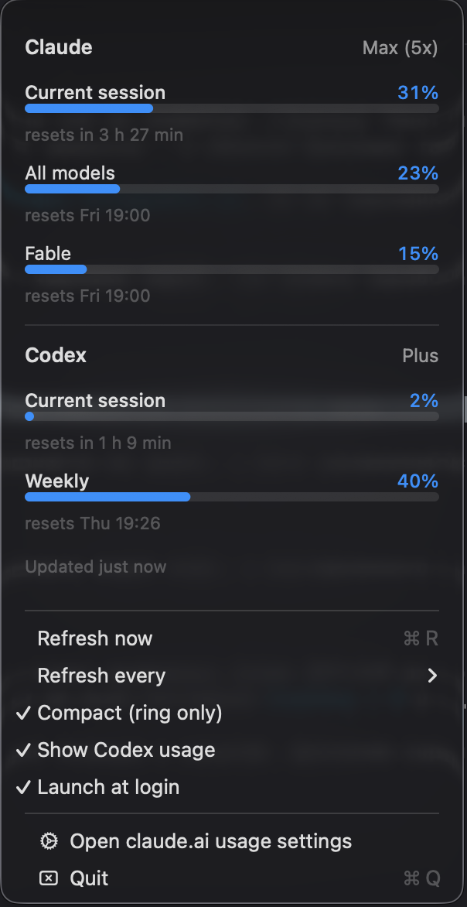

<h1 align="center">ClaudeX</h1>

<p align="center">
Claude &amp; Codex usage limits in your macOS menu bar.<br>
Know how much of your session and weekly window is left - without opening <code>/usage</code>.
</p>

<p align="center">

</p>

## What it shows

Exactly what Claude Code's `/usage` screen shows - live in the menu bar:

- **Claude** - current 5-hour session, weekly "All models", per-model weekly windows, reset times
- **Codex** (optional) - your ChatGPT plan's session and weekly windows

The ring in the menu bar reflects the hottest window: blue below 75%, orange from 75%, red from 90%.

## Install

```bash
git clone https://github.com/two-pizza/ClaudeX.git
cd ClaudeX
./build.sh --install
```

That's it. No Xcode, no dependencies - a single `swiftc` invocation from
Command Line Tools. The app lands in `~/Applications` and starts immediately.
This builds the menu bar app; the desktop widget needs Xcode (see below).
Or grab a prebuilt app from [Releases](https://github.com/two-pizza/ClaudeX/releases).

On first launch macOS may ask for Keychain access - click **Always Allow**.
The permission is granted to `/usr/bin/security`, so rebuilding the app never re-prompts.

## How it works

**Claude.** `GET https://api.anthropic.com/api/oauth/usage` with the OAuth token
Claude Code already keeps in your Keychain (`Claude Code-credentials`). The response
carries the same `limits[]` array Claude Code renders in `/usage` - so new windows
("Fable", per-model buckets) appear automatically, with no code changes here.

**Codex.** `GET https://chatgpt.com/backend-api/wham/usage` with the token Codex CLI
keeps in `~/.codex/auth.json`. Shown automatically when Codex is installed;
toggle it off in the menu if you don't want it.

**Tokens are read-only - never refreshed.** Refreshing rotates the refresh token
and would steal the CLI's own authorization. If a token expires, the panel says so;
running `claude` or `codex` once fixes it.

## Desktop widget

A WidgetKit widget for the desktop and Notification Center is in the tree
(`Sources/Widget/`). It needs Xcode and an Apple Developer team, because the
data crosses an App Group:

```bash
# 1. put your Apple Developer team id in Team.xcconfig (one line, comments explain where to find it)
# 2. generate and build
xcodegen generate
xcodebuild -project ClaudeX.xcodeproj -scheme ClaudeX -configuration Release build
```

The App Group is derived from that team id, so app and widget always agree and
no source file needs editing. To verify the handoff actually works:

```bash
ClaudeX.app/Contents/MacOS/ClaudeX --diagnose
# App Group: <TEAM>.group.me.andrey.ClaudeX
#   container: available - the widget will receive updates
```

Check that line. A wrong team id still produces a valid-looking signed build -
one whose widget silently never receives anything.

The widget never fetches anything. A widget extension is sandboxed and cannot
reach the Keychain, so the app writes each fresh snapshot into the shared
container and calls `WidgetCenter.reloadAllTimelines()`; the widget only reads.
Only rendered numbers cross that boundary - never tokens.

The app itself is deliberately **not** sandboxed: the sandbox would cut off the
Keychain item it reads. The widget extension is sandboxed, as macOS requires.

## Menu

| Item | |
|---|---|
| **Refresh now** (⌘R) | fetch immediately; also refreshes on menu open and on wake from sleep |
| **Refresh every** | 1 / 2 / 5 / 15 minutes (default 2) |
| **Compact** | ring only, no percentages |
| **Show Codex usage** | hide/show the Codex section |
| **Launch at login** | via `SMAppService` |

## Troubleshooting

```bash
# one fetch per provider, printed to the console (tokens never printed)
~/Applications/ClaudeX.app/Contents/MacOS/ClaudeX --diagnose

# runtime log
tail -f ~/Library/Logs/ClaudeX.log
```

| Symptom | Cause / fix |
|---|---|
| `—` in the menu bar | first fetch failed; it retries automatically |
| "not logged in" | run `claude` (or `codex`) once and authenticate |
| "Token rejected" | same - the CLI refreshes its token on next run |
| "Rate limited" | the usage endpoint throttled us; next tick recovers |

## Code layout

| File | Responsibility |
|---|---|
| `Sources/Shared/Models.swift` | shared data model for both providers |
| `Sources/App/Keychain.swift` | Claude Code token from the Keychain |
| `Sources/App/Providers.swift` | Claude + Codex fetch and response parsing |
| `Sources/App/UsageMenuView.swift` | the panel with limit bars |
| `Sources/App/StatusController.swift` | status item, ring icon, timer, settings |
| `Sources/App/Log.swift` | log file in `~/Library/Logs/` |
| `Sources/Shared/SharedStore.swift` | snapshot handoff to the widget |
| `Sources/Widget/` | WidgetKit extension (small / medium / large) |

See [ROADMAP.md](ROADMAP.md) for what's next (desktop widget, iOS, App Store).

## License

[MIT](LICENSE)
